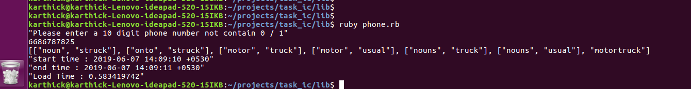

# Phone Number To Words Converter

The project is a Ruby script which takes an input of a 10 digit mobile number and converts into words by performing keypad's letter combinations against a dictionary.txt file

#### Contents 
 - Installation
 - Execution
 - Output Screen

## Installation
  - Clone the repository
  - Got to repository folder: `cd task_ic`

  - Install ruby 2.3.8
    - Using RVM: `rvm install 2.3.8` (Refer: https://gorails.com/setup/ubuntu/16.04)
    - Using Rbenv: `rbenv install 2.3.8` (Refer: https://gorails.com/setup/ubuntu/16.04)

## Execution
  - Run the program: `ruby lib/phone.rb`
  - Number should be 10 digits
  - Number should not contain 0 & 1 digits
  - The matching word's length is atleast 3 characters
  - This application is using a standard keypad

## Output screen
  